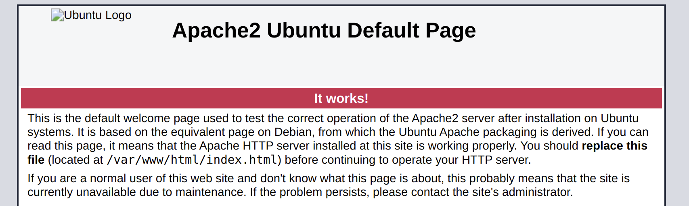

# Install LEMP stack (Linux & Nginx & MySQL & PHP)

## PHP

Let's start with PHP. The commands below update our system and add a source from where we will download PHP:

```
apt-get update && apt-get upgrade

apt-get install software-properties-common

add-apt-repository ppa:ondrej/php

apt-get update
```

Now we can install PHP:

`apt-get install php8.0`

Check the PHP installation via this command:

`php -v`

You should get something like this:

`PHP 8.0.0 (cli) (built: Nov 27 2020 12:26:22) ( NTS )`

Next, you should install common modules (extensions) for PHP. Here's the command for that:

`apt-get install php8.0-fpm php8.0-curl php8.0-gd php8.0-mbstring php8.0-zip php8.0-mysql php8.0-xml`

## Nginx

Install Nginx via this command:

`sudo apt install nginx`

Check Nginx status by running this command:

`systemctl status nginx`

You should see something like this:

<pre>
Output
● nginx.service - A high performance web server and a reverse proxy server
   Loaded: loaded (/lib/systemd/system/nginx.service; enabled; vendor preset: enabled)
   <b>Active: active (running)</b> since Fri 2020-04-20 16:08:19 UTC; 3 days ago
     Docs: man:nginx(8)
 Main PID: 2369 (nginx)
    Tasks: 2 (limit: 1153)
   Memory: 3.5M
   CGroup: /system.slice/nginx.service
           ├─2369 nginx: master process /usr/sbin/nginx -g daemon on; master_process on;
           └─2380 nginx: worker process
</pre>

Now, in your browser, go to http://localhost. You should see default "Welcome to Nginx!" page:



To create your first local website, follow these steps:

1. First, we need a website with some content. Create a directory `test-php` somewhere in your computer (preferably, in your `home` directory). The files structure is as follows:
   ```
   test-php
   |  index.html
   |  another.html
   |
   |  directory/
      |  inner.html
   ```
   Put some content into these files. You can just type `Hello, world!` there without any HTML tags, it will work.
2. Go to `/etc/nginx/sites-available/` and create a file with name `test-php.local.conf`. You can do this with command
   `sudo touch test-php.local.conf`. **Note**, that here we are using `sudo` - this is because now we're dealing with Linux's system files.
3. Put the content above in that file:
<pre>
server {
  server_name test-php.local;
  root DESTINATION/OF/YOUR/WEBSITE/test-php;
  index index.html;
}
</pre>

You can copy this and put it in the file with this command:

```
sudo xdg-open test-php.local.conf
```

And then just Ctrl + V :)

4. Now we need to tell Nginx that our website should be "online". Go to `/etc/nginx/sites-enabled` and run this command:
   
   `sudo ln -s ../sites-available/test-php.local.conf`

5. Now we need to reload Nginx, use this command:

  `sudo nginx -s reload`
  
6. Now we need to tell our computer that our website can be located by `localhost` IP address. To do that, open file `/etc/hosts` (remember about `sudo`)
and add the following line:
   
   `127.0.0.1	php-test.local`

Now you should be able to view your local website. Go to these pages:
```
http://php-test.local
http://php-test.local/index.html
http://php-test.local/another.html
http://php-test.local/directory/inner.html
http://php-test.local/foo
```

Only the last URL must give you a 404 error page.

## MySQL

### To be done